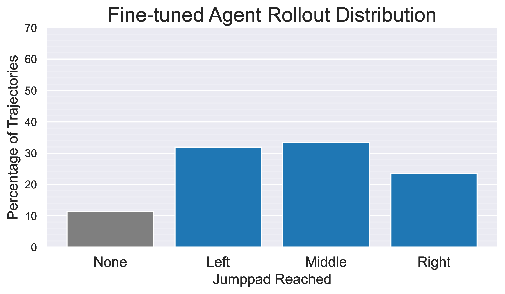
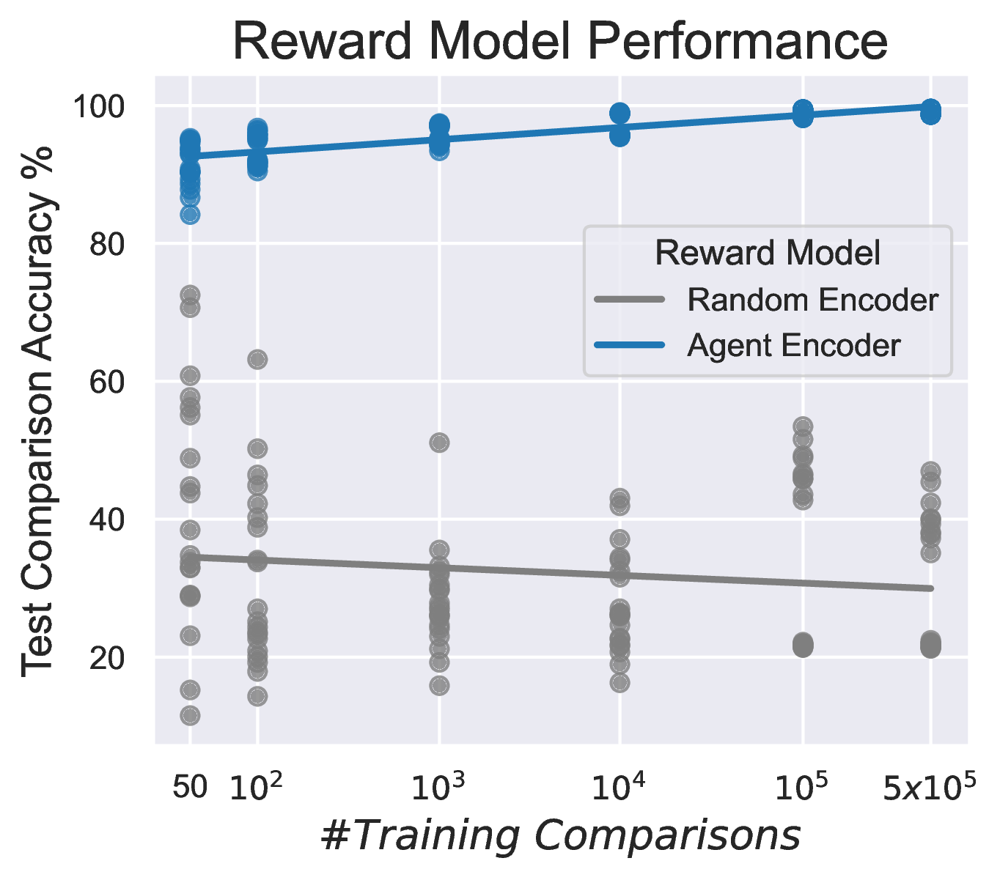

In this project, we investigate training an agent by following the modern Large Language Model (LLM) alignment pipeline of unsupervised pre-training, supervised fine-tuning and reinforcement learning from human feedback (RLHF) on the Xbox game <a href="https://www.bleedingedge.com/en">Bleeding Edge</a>.

## Motivation

Training an agent with imitation learning provides a scalable approach to learning how to behave in a complex 3D environment from high-dimensional visual information (pixels). However, imitation agents do not always perform the desired behaviors when deployed!

<figure>
<video autoplay muted loop playsinline style="pos: left; width: 49%">
    <source src="assets/Base Model/Bad Navigation.mp4" type="video/mp4">
</video>
<video autoplay muted loop playsinline style="pos: right; width: 49%">
    <source src="assets/Base Model/Navigates Off Track.mp4" type="video/mp4">
</video>
<video autoplay muted loop playsinline style="pos: left; width: 49%">
    <source src="assets/Base Model/Not Reaching Jumppad.mp4" type="video/mp4">
</video>
<video autoplay muted loop playsinline style="pos: right; width: 49%">
    <source src="assets/Base Model/Shadow Boxing.mp4" type="video/mp4">
</video>
<figcaption><blockquote>A 103M parameter GPT-style transformer agent, trained with imitation learning on 1.12 years of Bleeding Edge human gameplay. Not all imitated behaviors are desirable! <br/><br/>Note that videos are not representative of typical gameplay.</blockquote></figcaption>
</figure>

In this work, we consider an illustrative example where the agent spawns on an island with three jumppads (the yellow ramps in the above videos). We would like our agent to navigate directly to the left (or right) jumppad. We see that our general imitation learning agent sometimes performs this behavior, but not reliably, and over 40% of the time fails to reach any jumppad at all.

<center><figure>
  
  <figcaption style="width:70%"><blockquote>General imitation learning agent jumppad success rates.</blockquote></figcaption>
</figure></center>

We draw an analogy between the undesirable behaviors of our imitation learning agent and the unhelpful respones of unaligned LLMs. Unaligned LLMs (trained only with unsupervised pre-training) contain a lot of knowledge, but frequently produce unhelpful responses, and must be aligned with subsequent supervised pre-training and reinforcement learning from human feedback (RLHF) stages to make them useful. Analagously, while scaling up our model and data can provide improved gameplay knowledge and generality, it provides no means for the agent to distinguish between expert and novice behaviors (or more generally, desired and undesired behaviors).

<center><figure>
  
  <figcaption style="width:100%"><blockquote>Artistic illustration of LLM alignment. Source: <a href="https://huyenchip.com/2023/05/02/rlhf.html">https://huyenchip.com/2023/05/02/rlhf</a></blockquote></figcaption>
</figure></center>

By following the [modern LLM alignment pipeline](https://huyenchip.com/2023/05/02/rlhf.html), we hope to align our base imitation model to reliably perform the desired behavior, and make it useful. More generally, this may include adjusting the ability of the agent, to obtain different gameplay styles or personalities, or just to achieve more human-like behavior.

<center><figure>
  
  <figcaption><blockquote>Alignment improves perceived helpfulness across langauge model sizes (InstructGPT). Source: <a href="https://openai.com/index/instruction-following">https://openai.com/index/instruction-following</a></blockquote></figcaption>
</figure></center>

---

## Supervised Fine-Tuning

We begin by fine-tuning our base imitation agent on curated trajectories that travel directly to a jumppad.

<figure>
<video autoplay muted loop playsinline style="pos: right; width: 32%">
    <source src="assets/Fine-Tuned Model/Successful Left.mp4" type="video/mp4">
</video>
<video autoplay muted loop playsinline style="pos: left; width: 32%">
    <source src="assets/Fine-Tuned Model/Successful Middle.mp4" type="video/mp4">
</video>
<video autoplay muted loop playsinline style="pos: right; width: 32%">
    <source src="assets/Fine-Tuned Model/Successful Right.mp4" type="video/mp4">
</video>
<figcaption><blockquote>Demonstration trajectories of an agent going to the left, middle and right jumppads.</blockquote></figcaption>
</figure>

We find that our fine-tuned agent has an increased success rate for reaching all three jumppads. However, the agent still does not have a preference for a particular jumppad, and reaches all three in roughly even proportions (as expected from the training data).

<center><figure>
  
  <figcaption style="width:80%"><blockquote>Fine-tuned imitation learning agent jumppad success rates.</blockquote></figcaption>
</figure></center>

While these demonstration trajectories can be successfully used for fine-tuning our agent, we find that training an agent from scratch on these limited trajectories does not perform as well. For example, we find that pre-training makes the agent more robust to going out of distribution of the fine-tuning trajectories, since the agent has additional information from pre-training on how to return to the distribution of desired trajectories.

<figure>
<video autoplay muted loop playsinline style="pos: left; width:49%">
  <source src="assets/Fine-Tuned Model/Fine-Tuned Missing but Turning Around.mp4" type="video/mp4">
</video>
<video autoplay muted loop playsinline style="pos: right; width:49%">
  <source src="assets/Fine-Tuned Only Model/Agent Missing.mp4" type="video/mp4">
</video>
<figcaption><blockquote>The general pre-trained agent (left) is more robust to going out-of-distribution than the fine-tuned only agent (right). This simple example demonstrates the benefits of incorporating larger scale data with unsupervised pre-training.</blockquote></figcaption>
</figure>

## Preference Modeling

Still following the LLM alignment pipeline, we now train a reward model to capture our preferences about the fine-tuned agent's behavior. In our work we use synthetic preferences to investigate how performance scales with preference labels (a proxy for human labellilng time). We find that initializing the reward model with the pre-trained agent enables the reward model to capture our preferences much more accurately, enabling strong performance with comparatively few preference labels.

<center><figure>
  
  <figcaption style="width:80%"><blockquote>Reward model test performances.</blockquote></figcaption>
</figure></center>

## Alignment with Reinforcement Learning (Synthetic RLHF)

We can now align our agent with our preferences by further fine-tuning our agent with reinforcement learning using our reward models. We find that we are able to significantly improve alignment efficiency via first fine-tuning on the trajectories which are labelled with the greatest reward. This is similar to <a href="https://arxiv.org/abs/2308.08998">Reinforced Self-Training (ReST) (Gulcehre et al. 2023)</a> introduced for LLM alignment. We term this additional alignment step *preference fine-tuning*.

We find that with this improved alignment procedure we are able to reliably align our agent within our limited compute budget to reach both the left and the right jumppads.

### Left Jumppad Alignment

<figure>
<video autoplay muted loop playsinline style="pos: left; width: 49%">
    <source src="assets/Aligned towards Left Jumppad/Left Example 1.mp4" type="video/mp4">
</video>
<video autoplay muted loop playsinline style="pos: right; width: 49%">
    <source src="assets/Aligned towards Left Jumppad/Left Example 2.mp4" type="video/mp4">
</video>
<video autoplay muted loop playsinline style="pos: left; width: 49%">
    <source src="assets/Aligned towards Left Jumppad/Left Example 3.mp4" type="video/mp4">
</video>
<video autoplay muted loop playsinline style="pos: right; width: 49%">
    <source src="assets/Aligned towards Left Jumppad/Left Example 4.mp4" type="video/mp4">
</video>
<figcaption><blockquote>The agent has been aligned to consistently reach the left jumppad.</blockquote></figcaption>
</figure>

<center><figure>
  
  <figcaption style="width:80%"><blockquote>Left-aligned agent jumppad success rates.</blockquote></figcaption>
</figure></center>

### Right Jumppad Alignment

<figure>
<video autoplay muted loop playsinline style="pos: left; width: 49%">
    <source src="assets/Aligned towards Right Jumppad/Right Example 1.mp4" type="video/mp4">
</video>
<video autoplay muted loop playsinline style="pos: right; width: 49%">
    <source src="assets/Aligned towards Right Jumppad/Right Example 2.mp4" type="video/mp4">
</video>
<video autoplay muted loop playsinline style="pos: left; width: 49%">
    <source src="assets/Aligned towards Right Jumppad/Right Example 3.mp4" type="video/mp4">
</video>
<video autoplay muted loop playsinline style="pos: right; width: 49%">
    <source src="assets/Aligned towards Right Jumppad/Right Example 4.mp4" type="video/mp4">
</video>
<figcaption><blockquote>Alternatively, the agent can be aligned to consistently reach the right jumppad.</blockquote></figcaption>
</figure>

<center><figure>
  
  <figcaption style="width:80%"><blockquote>Right-aligned agent jumppad success rates.</blockquote></figcaption>
</figure></center>

## Alignment Summary

A summary of our alignment procedure and a heatmap of agent trajectories for each stage of alignment are shown below.

<center><figure>
  
  <figcaption><blockquote>Overview of our procedure for aligning an agent.</blockquote></figcaption>
</figure></center>
<center><figure>
  
  <figcaption><blockquote>Heatmap of our agent's trajectories at each stage of alignment.</blockquote></figcaption>
</figure></center>

## Conclusion

We demonstrated that the modern LLM training procedure can be used to reliably align agents to perform desired behaviors in complex environments. These behaviors would be difficult to achieve with any one stage of training alone. Our analysis shows that many of the recent developments in the current procedure for training LLMs can also be applied and have similar benefits for training agents.

Check out the full paper for more details: [https://arxiv.org/abs/2406.04208](https://arxiv.org/abs/2406.04208)

And a big thank you to [Ninja Theory](https://www.ninjatheory.com) for enabling this research as part of [Project Paidia](https://www.microsoft.com/en-us/research/project/project-paidia/)!

## Citation

If you found this work interesting, please consider citing our paper:

```
@misc{jelley2024aligning,
      title={Aligning Agents like Large Language Models},
      author={Adam Jelley and Yuhan Cao and Dave Bignell and Sam Devlin and Tabish Rashid},
      year={2024},
      eprint={2406.04208},
      archivePrefix={arXiv},
      primaryClass={cs.LG}
}
```